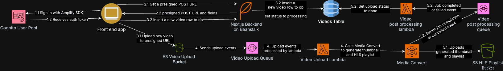
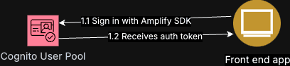
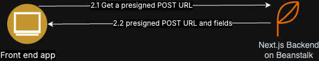
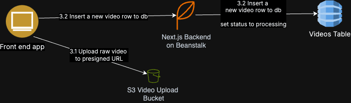
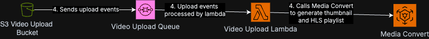
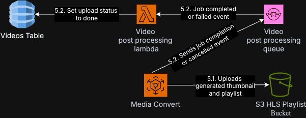

## About

This is a backend focused project to demonstrate:
- Video processing pipeline for streaming services.
- Various usage of AWS services.

## Technologies

### Backend

 


 
 


 

### Frontend

 

 
 

## Highlights
✅ Infrastructure as Code with Terraform. Deploy everything with a single command.  
✅ Secure services with strict roles and policies  
✅ Video processing with AWS Elemental MediaConvert to produce HLS playlist  
✅ S3 to store raw videos and processed HLS playlist  
✅ Event processing with AWS Lambda and SQS  
✅ CloudWatch event to filter finished Media Convert jobs  
✅ User management with AWS Cognito  
✅ Database with DynamoDB  
✅ Frontend with Next.js and React  

## Non goals
Beautiful and feature complete front end: This is a backend focused project.  
High availability: I use minimal infrastructure to keep costs down.

## Deploying to AWS

You'll need an AWS account with credit card to use Media Convert.

Please install the following tools:
- [AWS CLI](https://docs.aws.amazon.com/cli/latest/userguide/getting-started-install.html)
- [cURL](https://curl.se/download.html)
- [Terraform CLI](https://developer.hashicorp.com/terraform/install)

Make sure you are signed in to [AWS CLI](https://docs.aws.amazon.com/signin/latest/userguide/command-line-sign-in.html).

Then run the following command:
```
terraform init
terraform apply
```

## Video processing pipeline explained



### 1. Authentication



Every uploaded video must have an owner. This means users must sign in before uploading videos.

I use Amplify's React UI to handle sign in and sign up, store the access token in cookie storage.

### 2. Request a presigned POST URL



After the user is authenticated, the frontend will request a presigned POST URL from the backend.

The backend will:
1. Generate a new ULID which is going to be used as the object key and also the video ID in database.
2. Generate a presigned POST URL with `x-amz-user-id` set to the owner of the video, and also limit the upload size to 100MB.
3. Return the presigned POST URL and the video ID to the frontend.

### 3. Upload the video and write to database



The video is uploaded to the presigned POST URL.

Once the video is uploaded, the front end ask the back end to create a new video record in database with the specified video ID.

The backend verifies whether the `x-amz-user-id` of the object matches the owner of the video.

The new video record will have these fields:
- title
- description
- status set to `processing`. Videos with this status will not show up in the home page.
- createdAt
- userId

### 4. Generate an HLS playlist from uploaded video



Once the video is uploaded, an event will be sent to an SQS queue which is consumed by a Lambda function.

The Lambda function will:
1. Use `ffprobe` to get the video resolution.
2. Calculate the resolutions of the HLS playlist.
- A 720p source video will produce 720p, 480p, 360p and 240p resolutions.
- A 370p source video will produce 360p and 240p resolutions.
3. Send a job to AWS Elemental MediaConvert to generate the HLS playlist with the calculated resolutions.

#### Lambda layer

In order to use `ffprobe`, I need to include the ffprobe binary in a separate Lambda layer.

The Lambda layer is packaged in a separate [repository](https://github.com/esam091/ffprobe-lambda-layer) and can be downloaded easily with curl.

### 5. Media Convert post processing



When a successful Media Convert job has finished, the results will be stored in a separate HLS playlist bucket.

This bucket is publicly readable so no signed URL required to get the thumbnail and the HLS playlist.

The video's status needs to be updated to either `done` or `failed` by:
1. Using CloudWatch event, filtered only for `COMPLETE` or `ERROR` events coming from the video upload bucket.
2. SQS and Lambda will handle the filtered CloudWatch event, get the video id from the event, and update the video's status.
3. Aside from that, the raw video of the finished job will be deleted.